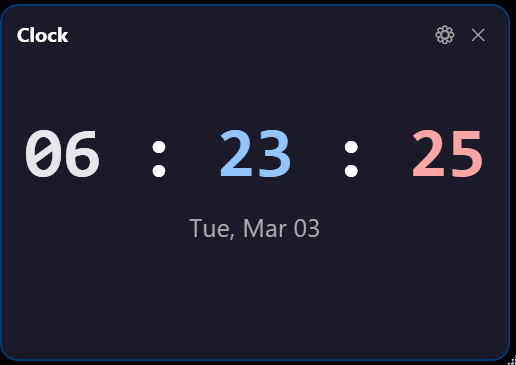

# EchoUI
Just a simple widget tool I'm working on. It was initially built as a Fences Alternative, but working on adding more features. It currently has the following features

* Folder Widget: Lets you select a specific folder on your drive and display all the icons in that folder
* Shortcut Widget: Lets you add specific shortcuts and add arguments to them
* CPU Widget: Displays the current CPU usage and temperature
* RAM Widget: Displays the current RAM usage
* Media Control Widget: Displays the current media playing on your system and allows you to control it
* Video Widget: Lets you select a video file and play it in the widget
* Weather Widget: Displays the current weather for a specific location
* Clock Widget: Displays the current time and date
* All Widgets: Custom coloring per widget

**To Do**
* Add widgets for Network Usage, Disk Usage, and GPU Usage
* Make this Readme file better and add more screenshots
* Bug Fixes

### Screenshots

**Clock Widget**
View the time, now with custom colors
